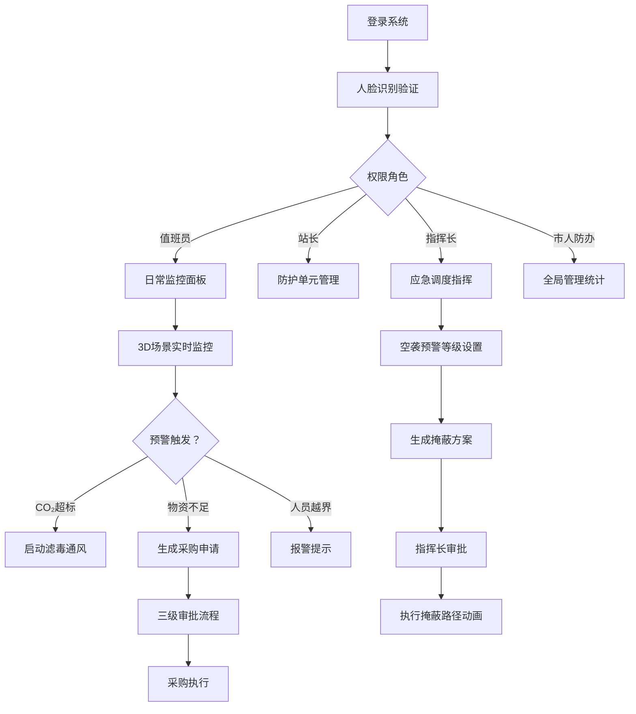

## 1. 产品概述
3D智慧人防工程综合管控与应急调度可视化平台，基于Three.js实现人防工程的三维可视化管理，涵盖防空地下室、防护设备、通风系统、物资仓库、人员掩蔽和应急指挥等核心功能，实现平时/战时双状态切换、智能预警、应急调度和三级审批流程。

- 目标用户：人防办值班员、站长、指挥长、市人防办管理人员
- 核心价值：实现人防工程智能化、可视化管理，提升应急响应效率

## 2. 核心功能

### 2.1 用户角色
| 角色 | 登录方式 | 核心权限 |
|------|----------|----------|
| 值班员 | 人脸识别 | 日常监控、数据查看、预警处理 |
| 站长 | 人脸识别 | 防护单元管理、物资审批（一级）、演练管理 |
| 指挥长 | 人脸识别 | 应急方案审批、掩蔽路线调整、指挥调度 |
| 市人防办 | 人脸识别 | 物资采购审批（三级）、全局数据统计、系统管理 |

### 2.2 功能模块
1. **3D主场景**：人防工程三维可视化展示，包含多个防空地下室、防护门、通风系统、物资仓库、人员掩蔽区、指挥中心
2. **防护单元监控**：平时/战时状态切换、防护门状态、环境参数（含氧量、CO₂浓度、温湿度）、结构健康数据
3. **通风滤毒系统**：CO₂浓度自动预警、风机旋转动画、滤毒模式自动启动
4. **战备物资管理**：食品/水/药品库存监控、有效期预警、三级审批采购流程
5. **人员定位系统**：实时位置显示、未防护区报警、姓名标签展示
6. **应急调度系统**：空袭预警等级（绿蓝黄红）、掩蔽路径动画、方案审批执行
7. **防护门故障处理**：自动锁定、维修工单派发、路线动态调整
8. **数据统计导出**：按月度导出物资消耗和应急演练Excel报表
9. **权限管理**：四级权限体系、人脸识别登录

### 2.3 页面详情
| 页面名称 | 模块名称 | 功能描述 |
|----------|----------|----------|
| 登录页 | 人脸识别登录 | 摄像头人脸识别、角色选择、系统登录 |
| 3D主控台 | 三维场景 | 人防工程全景3D展示、场景漫游、视角切换 |
| 3D主控台 | 监控面板 | 实时环境数据、防护单元状态、预警信息展示 |
| 防护单元详情 | 状态面板 | 平时/战时状态切换、环境参数趋势图 |
| 防护单元详情 | 结构健康 | 结构检测数据、加固历史记录 |
| 物资仓库 | 库存管理 | 分类物资展示、库存数量、有效期监控 |
| 物资仓库 | 采购审批 | 采购申请、街道-区-市三级审批流程 |
| 人员定位 | 实时监控 | 人员3D模型、姓名标签、位置追踪 |
| 应急调度 | 预警管理 | 空袭等级设置、掩蔽方案生成 |
| 应急调度 | 路径规划 | 四色路径动画、方案审批执行 |
| 统计报表 | 数据导出 | 月度物资消耗统计、应急演练统计、Excel导出 |

## 3. 核心流程

### 3.1 登录流程
用户进入系统 → 人脸识别验证 → 角色权限匹配 → 进入主控台

### 3.2 CO₂超标预警流程
CO₂浓度 > 1.5% → 触发预警 → 自动启动滤毒通风（3D风机旋转）→ 推送预警信息 → 值班员确认处理

### 3.3 物资采购审批流程
库存低于7天用量 → 橙色闪烁预警 → 自动生成采购申请 → 街道人防办审批 → 区人防办审批 → 市人防办审批 → 采购执行

### 3.4 人员掩蔽调度流程
空袭预警升级 → 系统自动生成掩蔽方案（四色路径）→ 指挥长审批 → 路径动画展示 → 人员疏散引导 → 未防护区报警

### 3.5 防护门故障处理流程
防护门故障检测 → 自动锁定 → 派发维修工单 → 动态调整掩蔽路线 → 维修完成后解锁

## 4. 用户界面设计

### 4.1 设计风格
- **主题风格**：军事科技风，深蓝主色调，霓虹光效，科技感界面
- **主色调**：#0a1628（深蓝背景）、#00d4ff（科技蓝主色）、#ff6b35（橙色预警）、#ff3366（红色警报）
- **辅助色**：#00ff88（绿色正常）、#ffcc00（黄色警告）
- **按钮风格**：科技感边框，渐变背景，hover时发光效果
- **字体**：主标题使用 Orbitron（科技感字体），正文使用 Rajdhani 或 Roboto
- **布局**：左侧导航栏 + 中央3D场景 + 右侧数据面板 + 底部状态栏
- **图标风格**：线性图标，科技感，支持发光效果

### 4.2 页面设计概述
| 页面名称 | 模块名称 | UI Elements |
|----------|----------|-------------|
| 登录页 | 人脸识别 | 深色背景、扫描框动画、面部识别光效、角色选择卡片 |
| 3D主控台 | 三维场景 | 全屏3D渲染、半透明HUD面板、数据悬浮标签、预警闪烁特效 |
| 3D主控台 | 监控面板 | 玻璃拟态卡片、实时数据波形图、状态指示灯、预警滚动条 |
| 详情弹窗 | 数据面板 | 毛玻璃背景、标签页切换、趋势图表、时间轴记录 |
| 审批页 | 流程面板 | 步骤指示器、审批意见框、电子签名区域、审批记录时间线 |

### 4.3 响应式
- 桌面端优先设计，适配 1920×1080 及以上分辨率
- 右侧面板支持折叠收起，3D场景自适应
- 触控设备支持手势旋转、缩放场景

### 4.4 3D场景设计
- **环境**：地下人防工程风格，人工光源，金属质感材质
- **灯光**：多盏点光源模拟工程照明，应急灯红色闪烁效果
- **相机**：默认俯视全景视角，支持自由漫游、第一人称、单元特写三种视角
- **动画**：防护门开关动画、风机旋转动画、人员行走动画、路径流光动画
- **后期**：Bloom发光效果、轻微色差、景深效果增强科技感
- **性能**：使用实例化渲染优化人员模型，LOD优化远距离物体

## 5. 数据模型
### 5.1 核心实体
- 防护单元：ID、名称、位置、平时/战时状态、结构健康评分、加固记录
- 环境传感器：ID、防护单元ID、类型（O₂/CO₂/温湿度）、当前值、阈值、时间戳
- 防护门：ID、防护单元ID、开闭状态、故障状态、锁定状态、最后维护时间
- 通风系统：ID、防护单元ID、运行状态、风机转速、滤毒模式
- 物资：ID、类型（食品/水/药品）、名称、数量、单位、有效期、日消耗量
- 人员：ID、姓名、角色、当前位置、状态、进入时间
- 采购申请：ID、物资清单、申请人、当前审批节点、审批状态、审批记录
- 应急方案：ID、预警等级、路径数据、审批状态、创建时间、执行记录
- 维修工单：ID、设备ID、故障描述、处理状态、派单时间、完成时间
- 用户：ID、姓名、角色、人脸特征数据、权限列表
