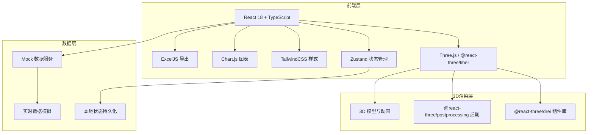

## 1. 架构设计



## 2. 技术选型

- **前端框架**：React 18 + TypeScript
- **构建工具**：Vite 5
- **3D引擎**：Three.js r160 + @react-three/fiber + @react-three/drei
- **状态管理**：Zustand
- **样式方案**：TailwindCSS 3
- **图表库**：Chart.js + react-chartjs-2
- **Excel导出**：ExcelJS
- **UI组件**：自定义科技风组件，lucide-react图标
- **路由**：react-router-dom 6

## 3. 目录结构

```
d:\新项目\293/
├── src/
│   ├── components/          # 通用组件
│   │   ├── ui/             # 基础UI组件
│   │   ├── layout/         # 布局组件
│   │   └── charts/         # 图表组件
│   ├── pages/              # 页面组件
│   │   ├── Login/          # 登录页
│   │   ├── Dashboard/      # 3D主控台
│   │   ├── Shelter/        # 防护单元详情
│   │   ├── Warehouse/      # 物资仓库管理
│   │   ├── Personnel/      # 人员定位
│   │   ├── Emergency/      # 应急调度
│   │   └── Reports/        # 统计报表
│   ├── components3d/       # 3D组件
│   │   ├── Scene/          # 主场景
│   │   ├── ShelterUnit/    # 防护单元模型
│   │   ├── Door/           # 防护门模型
│   │   ├── Ventilation/    # 通风系统模型
│   │   ├── Personnel/      # 人员模型
│   │   ├── Warehouse/      # 仓库模型
│   │   └── Effects/        # 特效组件（路径、预警等）
│   ├── store/              # Zustand状态
│   │   ├── useAuthStore.ts
│   │   ├── useShelterStore.ts
│   │   ├── useWarehouseStore.ts
│   │   ├── usePersonnelStore.ts
│   │   └── useEmergencyStore.ts
│   ├── utils/              # 工具函数
│   │   ├── excel.ts        # Excel导出
│   │   ├── mockData.ts     # Mock数据生成
│   │   └── animation.ts    # 动画工具
│   ├── types/              # TypeScript类型定义
│   ├── App.tsx
│   ├── main.tsx
│   └── index.css
├── public/                 # 静态资源
├── .trae/documents/        # 项目文档
├── package.json
├── vite.config.ts
├── tsconfig.json
└── tailwind.config.js
```

## 4. 状态管理设计

### 4.1 认证状态 (useAuthStore)
```typescript
interface AuthState {
  isLoggedIn: boolean;
  currentUser: User | null;
  login: (faceData: FaceData) => Promise<boolean>;
  logout: () => void;
}
```

### 4.2 防护单元状态 (useShelterStore)
```typescript
interface ShelterState {
  units: ShelterUnit[];
  selectedUnit: string | null;
  environmentData: EnvironmentData[];
  doorStatus: DoorStatus[];
  ventilationStatus: VentilationStatus[];
  updateEnvironment: () => void;
  toggleDoor: (unitId: string, doorId: string) => void;
  startVentilation: (unitId: string) => void;
}
```

### 4.3 物资仓库状态 (useWarehouseStore)
```typescript
interface WarehouseState {
  materials: Material[];
  purchaseRequests: PurchaseRequest[];
  lowStockAlert: Material[];
  createPurchaseRequest: (materials: Material[]) => void;
  approvePurchase: (requestId: string, level: number) => void;
  checkStock: () => void;
}
```

### 4.4 人员状态 (usePersonnelStore)
```typescript
interface PersonnelState {
  personnel: Person[];
  trackedPersonnel: string[];
  alertPersonnel: string[];
  updatePositions: () => void;
  checkUnprotectedZones: () => void;
}
```

### 4.5 应急状态 (useEmergencyStore)
```typescript
interface EmergencyState {
  alertLevel: 'green' | 'blue' | 'yellow' | 'red';
  currentPlan: EmergencyPlan | null;
  maintenanceOrders: MaintenanceOrder[];
  setAlertLevel: (level: AlertLevel) => void;
  generateShelterPlan: () => EmergencyPlan;
  approvePlan: (planId: string) => void;
  createMaintenanceOrder: (deviceId: string, issue: string) => void;
}
```

## 5. 核心模块设计

### 5.1 3D场景模块
- 使用 @react-three/fiber 声明式构建3D场景
- @react-three/drei 提供OrbitControls、环境、文本等常用组件
- @react-three/postprocessing 实现Bloom、色差等后期效果
- 组件化设计：每个3D对象为独立组件，支持状态驱动动画

### 5.2 实时数据模拟
- setInterval 模拟传感器数据实时更新
- 随机波动算法模拟真实环境参数变化
- 定时触发预警事件（CO₂超标、库存不足等）

### 5.3 动画系统
- 防护门：使用gsap + useFrame 实现平滑开关动画
- 风机：useFrame 持续旋转，根据状态调整转速
- 路径动画：TubeGeometry + 流光材质实现路径流动效果
- 人员：GLTF模型 + 骨骼动画，使用mixamo动作数据

### 5.4 Excel导出模块
- 使用 ExcelJS 生成工作簿
- 支持多sheet：物资消耗表、演练统计表
- 内置样式：表头加粗、数据格式、条件格式（预警标色）

## 6. 路由定义

| 路由 | 页面 | 权限要求 |
|------|------|----------|
| /login | 登录页 | 公开 |
| /dashboard | 3D主控台 | 所有登录用户 |
| /shelter/:id | 防护单元详情 | 值班员及以上 |
| /warehouse | 物资仓库管理 | 站长及以上 |
| /warehouse/purchase | 采购审批 | 对应审批权限 |
| /personnel | 人员定位 | 值班员及以上 |
| /emergency | 应急调度 | 指挥长及以上 |
| /reports | 统计报表 | 市人防办 |

## 7. 性能优化策略

1. **3D渲染优化**
   - 使用 InstancedMesh 渲染大量重复物体（人员模型）
   - LOD (Level of Detail) 优化远距离物体
   - 按需加载GLTF模型，使用Draco压缩

2. **React渲染优化**
   - 使用 memo 避免不必要的重渲染
   - Zustand 选择器细粒度订阅状态
   - 大数据列表使用虚拟滚动

3. **状态优化**
   - 状态分片，每个模块独立store
   - 避免深层嵌套状态，扁平化数据结构
   - 批量更新，减少渲染次数
